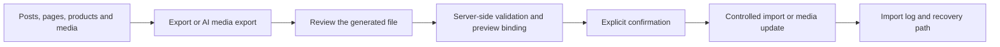

# Content Sync Manager — Safe WordPress Content & Media Workflows

> **Portfolio project · WordPress/PHP · ACF · WooCommerce · content import/export · guarded media updates**

Content Sync Manager is an admin-only WordPress plugin for controlled export, review, import and recovery of website content and media. It is built for situations where teams need to update structured WordPress content efficiently without turning bulk editing into an uncontrolled write process.

**Developer profile:** [Andrew Baeten](https://github.com/Yolol100) · [Portfolio cases](https://andrewbaeten.nl/category/cases)

## What problem it solves

Bulk content and media work becomes risky when updates affect ACF fields, WooCommerce products, images or content used in page builders. Content Sync Manager adds preview-before-write checks, capability boundaries, backups/recovery paths and explicit confirmation around higher-risk operations.

## Portfolio snapshot

| Area | What it demonstrates |
| --- | --- |
| WordPress | Posts, pages, products and supported custom post types |
| Structured content | Dynamic ACF field detection and validated import/export |
| WooCommerce | Product content support within controlled WordPress workflows |
| Media | Metadata context, image usage detection and guarded filename changes |
| Safety | Preview binding, validation, permission checks, backups and fail-closed behaviour |
| Delivery | Runtime matrices, Plugin Check, WPCS/PHPCS, Composer audit and deterministic release builds |

## Workflow at a glance



## Quick technical review

Useful places to inspect:

- `tests/` — static and runtime coverage for content, media and ACF workflows.
- [`.github/workflows/quality.yml`](.github/workflows/quality.yml) — coding standards and dependency quality checks.
- [`.github/workflows/runtime-release-gate.yml`](.github/workflows/runtime-release-gate.yml) — clean WordPress runtime validation.
- `scripts/build_release.py` — deterministic release-package construction.
- `CHANGELOG.md` — full version history and release notes.
- `readme.txt` — WordPress-style distribution metadata.

## Installation

1. Upload the plugin folder or ZIP through WordPress.
2. Activate the plugin on staging first where possible.
3. Open Pages, Posts, Products, a supported custom post type, or Media > Library in the admin.
4. Use the Content Sync toolbar or the AI image controls in the Media Library.

## AI image context

In Media > Library, `AI image export` works in both list and grid view. For each selected image, the export includes existing media metadata, WordPress usage locations, page context, exact ACF paths for image/gallery/group/repeater/flexible-content fields where available, plus temporary non-cropped previews up to 512 px and 1024 px.

Temporary previews are created in a separate uploads subdirectory and cleaned up automatically. If a temporary preview cannot be created, an existing WordPress resize is used only when it is demonstrably uncropped and preserves the original aspect ratio. The plugin does not make external AI or tracking calls.

ChatGPT may only change the values `new_filename`, `title`, `alt`, `caption` and `description` in the JSON line under `MEDIA IMPORT`. JSON prevents ordinary metadata lines such as `Title:` or `EINDE MEDIA IMPORT` from breaking the import format. Legacy 1.2.62 label blocks remain importable for backwards compatibility.

The same TXT file can then be checked and written back through `AI data import`. The import requires the same nonce/capability boundary as Content Sync, a preview hash of the exact TXT content and explicit confirmation. Filename changes reuse the existing guarded media-rename function. A physical rename fails closed when the usage scan is incomplete, when a fixed media URL is found in private/builder metadata such as Elementor `_elementor_data`, when an unsupported storage location is used, or when the current user cannot edit every affected usage page. Safe metadata updates can still continue. Internal Content Sync archive metadata such as `_dca_tb_backups` is intentionally not treated as an active usage location.

## Safe use

- Test on staging first.
- Create a database and uploads backup before higher-risk operations.
- Use `Check file` before running the normal Content Sync import.
- The AI media import performs its own server-side validation and binds execution to the exact same TXT content.
- An import run is blocked server-side when the TXT content does not exactly match the last checked preview for the same user.
- Media renaming is enabled through `DCA_TB_ALLOW_MEDIA_FILE_RENAME` and remains behind the existing extension, MIME type, uploads-path, target-file, usage-location, permission and backup checks.

## Requirements

- WordPress 6.2+
- PHP 7.4+
- ACF 6.8.9 for page, product and custom-post-type fields managed through ACF
- For WooCommerce products: WordPress 6.9+ and WooCommerce 11.0.1

The release gate covers the declared minimum combination WordPress 6.2.11/PHP 7.4/ACF 6.8.9, the existing WooCommerce baseline WordPress 7.0.4/PHP 8.3/ACF 6.8.9/WooCommerce 11.0.1, and WordPress 7.1 on PHP 8.3 plus PHP 8.5. The WordPress 7.1/PHP 8.3 lane also includes WooCommerce 11.0.1. In each environment, the built ZIP is clean-installed and force-updated. Export, preview, import, import log and recovery are then exercised on real WordPress content; the WooCommerce matrices also test a product and the AI media export/import flow with a physical filename change. The AI media hardening test additionally covers builder/private metadata, usage-page permissions, JSON round-tripping with delimiter text and rejection of cropped preview fallbacks. Plugin Check runs in the stable WordPress 7.0.4/PHP 8.3 lane, while WPCS/PHPCS and Composer audit run in the quality gate.

Known test limitation: WooCommerce 11.0.1 emits one `_load_textdomain_just_in_time` notice for its own `woocommerce` text domain during the WP-CLI runtime. The gate allows only that exact recognized upstream notice and fails on any other notice, warning, fatal or debug entry. Content Sync flows themselves must complete without their own debug message.

When ACF is inactive or not fully available, the plugin shows an admin warning in the page/product list. Imports containing ACF fields are blocked server-side; post imports without ACF remain usable. The Media Library export still works for normal WordPress images, but exact ACF paths are then unavailable.

## Configuration

These constants can be set before the plugin loads:

```php
define('DCA_TB_ALLOW_MEDIA_FILE_RENAME', true); // enabled by default
define('DCA_TB_MAX_IMPORT_PAGES', 50);
define('DCA_TB_MAX_IMPORT_BYTES', 5242880);
define('DCA_TB_IMPORT_PREVIEW_TTL', 20 * MINUTE_IN_SECONDS);
define('DCA_TB_OVERWRITE_EXISTING_MEDIA', false);
define('DCA_TB_OVERWRITE_EXISTING_TEXT', true);
define('DCA_TB_OVERWRITE_EXISTING_TITLE', false);
define('DCA_TB_AI_IMAGE_CONTEXT_PREVIEW_MAX', 512);
define('DCA_TB_AI_IMAGE_CONTEXT_DETAIL_PREVIEW_MAX', 1024);
define('DCA_TB_AI_IMAGE_CONTEXT_USAGE_SCAN_MAX_POSTS', 2000);
```

## ACF fields

Page, product and custom-post-type export uses dynamic ACF detection. The plugin exports only fields that ACF detects on the relevant item and imports only fields that also exist through ACF on the target item. Older fixed ACF layouts such as hoofdtekst/titel_1/usp_1 are no longer written back.

For AI image context, the raw ACF structure is also traversed so an image can be linked to paths such as `acf:gallery[1]`, `acf:items[0].image` or `acf:flex[0]{hero}.image`. These paths are analysis context; they do not replace the existing ACF import contracts.

## Legacy snippets/plugins

Disable older Code Snippets/WPCode versions or older plugin variants before activating this version. The plugin blocks loading when legacy functions with the same names are already active.

## Version

1.2.63

## Release process

1. Pass the quality gate and automated clean WordPress runtime gate, then test the plugin ZIP on a representative staging installation with a backup.
2. Confirm that the plugin-header version, `DCA_TB_VERSION` and `Stable tag` match.
3. Only then create the matching tag, for example `v1.2.63`.
4. The tag workflow builds the ZIP twice, compares SHA-256 checksums and creates a **draft release** with the ZIP and checksum.
5. Publish the draft only after export, preview, import and recovery have been validated in the supported WordPress/PHP matrix and the Media Library UI has been manually reviewed on staging.

The same runtime package can be built locally with Python 3:

```shell
python scripts/build_release.py
```

## Changelog

### 1.2.63

- Compatibility: added WordPress 7.1 runtime coverage on PHP 8.3 and 8.5 without removing the existing minimum and WooCommerce baselines.
- Quality: added official Plugin Check validation, WPCS/PHPCS and Composer dependency audit to CI.
- I18n: both admin JavaScript files use `wp-i18n` and `wp_set_script_translations()` for user-facing UI text.
- Accessibility: existing dialog, live-region and focus contracts are covered as regression gates; browser/screen-reader review remains a separate staging test.

### 1.2.62

- AI Media: export controls work in Media Library list and grid views and read only the selected images.
- Preview: temporary 512 px and 1024 px previews are created without unnecessary cropping, with automatic cleanup and fail-closed fallback; existing fallback resizes must be uncropped and preserve the original aspect ratio.
- Context: export includes a WordPress usage scan and exact ACF paths for gallery, group, repeater and flexible content where available; fixed URLs in private/builder metadata are marked as unsafe rename locations.
- Round-trip: `MEDIA IMPORT` uses a collision-safe JSON line; legacy label blocks remain importable.
- Safety: import requires exact-preview binding and confirmation; physical renaming is also blocked when the current user cannot edit all usage pages.
- Quality: regression and runtime coverage includes AI media export/import, physical rename, nested ACF paths, Elementor/private metadata, permission boundaries, delimiter text and crop fallbacks.

See [CHANGELOG.md](CHANGELOG.md) for the full version history.

## About the developer

I am **Andrew Baeten**, a WordPress Developer with 10+ years of experience across **90+ WordPress projects** and ongoing responsibility for **120+ websites and webshops**. My current work also includes ongoing maintenance, quality checks and improvements across a large WordPress and WooCommerce portfolio.

[Portfolio cases](https://andrewbaeten.nl/category/cases) · [LinkedIn](https://www.linkedin.com/in/andrew-baeten-305a1478/) · [Email](mailto:info@andrewbaeten.nl)
